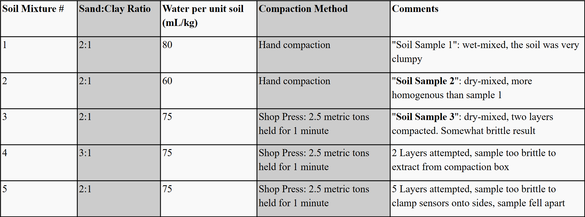
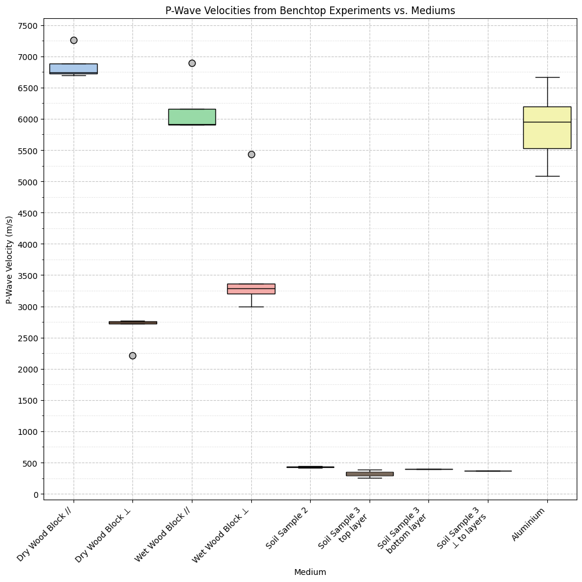

# The Effects of Applied Stress and Root-Soil Systems on Seismic Wave Velocities: Establishing Laboratory Ground Truth

## Research Overview

Trees and their root-soil systems play a key role in slope stability and natural hazard mitigation. By reinforcing the surrounding soil, root systems can reduce the likelihood of landslides, erosion, and slope failure. However, the subsurface root structure responsible for this effect remains poorly understood, limiting its incorporation into hazard assessment, infrastructure planning, and land management strategies.

Building on this gap, our research draws inspiration from the work of Brady Flinchum, who examined the extent of shear strengthening beneath longleaf pines, and Shiv M. Gupta, who characterized subsurface Critical Zone structure beneath Giant Sequoias. We aim to ground-truth root-driven shear strengthening through a series of controlled lab experiments conducted in the Seismic Soil Chamber (SSC). These experiments progress from simple to increasingly complex configurations, allowing us to isolate the relative contributions of overlying compaction and the presence, orientation, and moisture content of wood. The resulting data will inform an effective medium theory describing the mechanical behavior of root-soil systems. Finally, we will compare our results with Flinchum and Gupta’s field data and synthetic models to assess the accuracy and real-world implications of our findings.

## Research Objectives
* Create reproducible experiments to examine how tree roots and overlying stress influence seismic wave velocities in soil.
* Produce 2D seismic travel-time tomography models to resolve buried anomalies and stress bulbs (when overlying compaction is applied).
* Understand how overlying compaction and the presence of wood/roots appear in seismic tomography maps to better inform the findings of Flinchum and Gupta.
* Develop an effective medium theory of root-soil systems beneath trees for application in non-invasive root mapping and slope stability.

## Experimental design: Seismic Soil Chamber (SSC)
* .
* .
* .
* .

The Seismic Soil Chamber (SSC) is a 43 cm x 41.5 cm x 58.3 cm wooden box used to compact multiple layers of soil. Two aluminum columns (gray) reside opposite each other inside the SSC, each containing 5 P-wave Evident acoustic sensors (white triangles). Perpendicular to the columns and on top of the soil are two aluminum panels (green) with 2 S-wave Evident acoustic sensors. The SSC is centered on a shop press that can exert up to 30 US-Tons of force. The shop press is used to push a 40 cm column of wood onto a wooden lid to initially compact the soil, or a 7 cm x 8.82 cm wooden block in the center of the SSC to simulate overlying compaction.

Experiments are conducted from simplest to most complex as follows:
1. Compacted soil **only** (no overlying compaction, no wood).
2. Compacted soil **only** with overlying compaction (0.5T, 1.0T, 1.25T, no wood).
3. Compacted soil with a **single dry wood anomaly** buried (no overlying compaction).
4. Compacted soil with a **single dry wood anomaly** buried (0.5T, 1.0T, 1.25T).
5. Compacted soil with a **single wet wood anomaly** buried (no overlying compaction).
6. Compacted soil with a **single wet wood anomaly** buried (0.5T, 1.0T, 1.25T).
7. Compacted soil with **multiple small wooden anomalies** buried (no overlying compaction).
8. Compacted soil with **multiple small wooden anomalies** buried (0.5T, 1.0T, 1.25T).
9. Compacted soil with **actual root ball** buried (no overlying compaction).
10. Compacted soil with **actual root ball** buried (0.5T, 1.0T, 1.25T).

## Computational Workflow
1. Obtain raw seismic traces in the SSC under a specific experimental condition (see 1-10 above).
2. Pick first arrivals from raw traces.
3. Use first arrival times to determine time-travel data.
4. Use time-travel data to perform ray tracing of first arrival waves through the SSC.
5. Create a 2D seismic travel-time tomography model.
6. Interpret results and note key findings. 

## Code

### 1. First-Arrival Picking & Ray Tracing

This is the script where all first arrivals are picked. The program accepts .asd trace files and produces an interactive graph for making first-arrival picks. The picks are stored in a .pkl file, which can be used as a save state. Once all picks are made, they are exported to a CSV. During this, the program ray-traces the shortest path from the shot to each sensor based on the first-arrival picks. Experimental data is saved to a [Hugging Face](https://huggingface.co/datasets/mbenedetti212/SSC_All_Experiment_Traces) dataset.

### 2. Velocity Analysis

This script is to create a velocity vs. medium plot from benchtop experimental data. This includes dry and wet wood (in parallel or perpendicular orientations), soil samples, and aluminum. The script produces linear and exponential box-and-whisker plots, as well as a list of average velocities for each medium.

### 3. Experimental Setup Visualization

This script is used to develop the SSC cross-section and SSC Birds-Eye View figures. The user selects which objects they’d like to show or hide (e.g., shot locations, compaction zone, labels, sensor groups). The code outputs a figure for different experimental setups.

## Data
All raw data is stored separately [here on Hugging Face](https://huggingface.co/datasets/mbenedetti212/SSC_All_Experiment_Traces).

## Preliminary Results
* .
* .

## Research Status

Ongoing as of August 2026

## Author
Madelyn S. Benedetti - Virginia Tech
