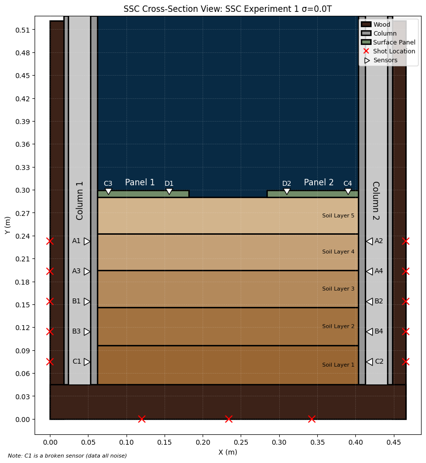
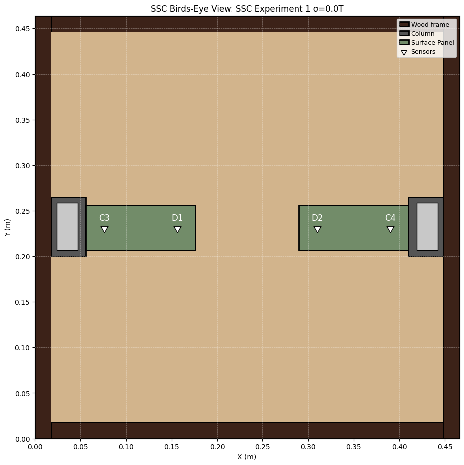
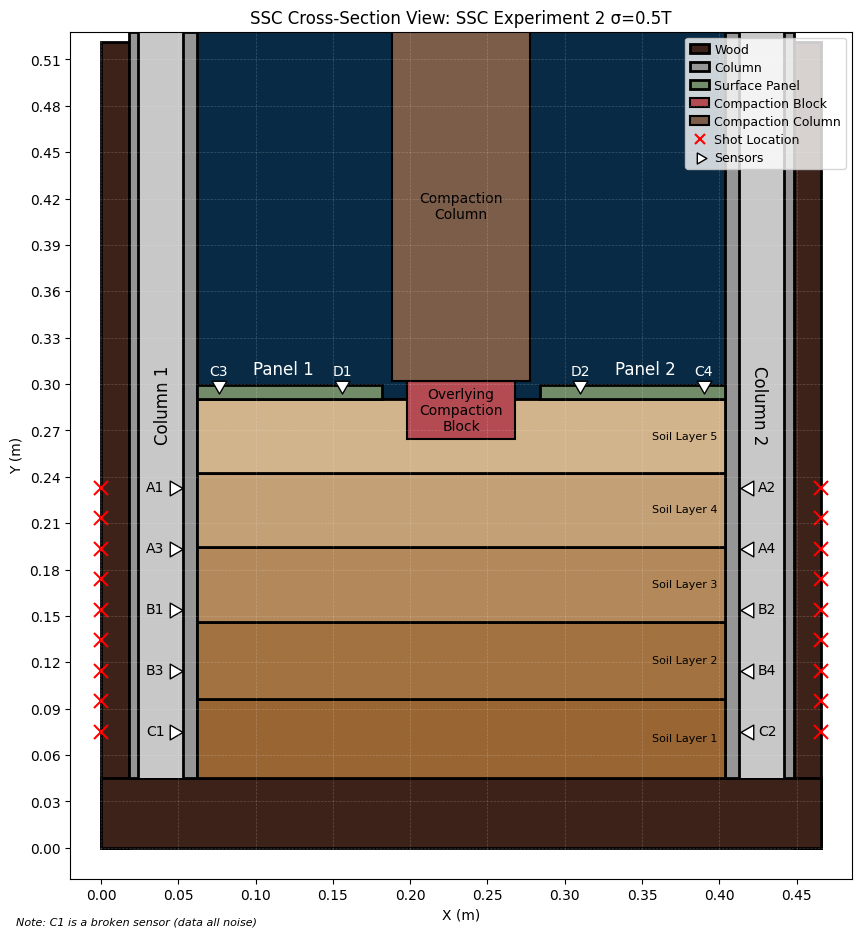
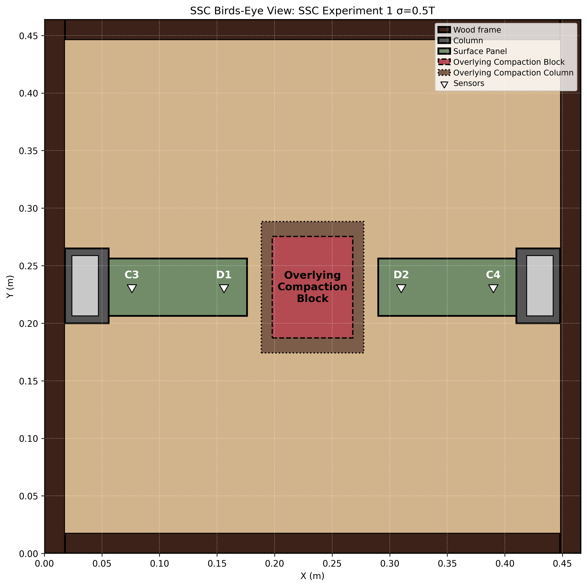

# The Effects of Applied Stress and Root-Soil Systems on Seismic Wave Velocities: Establishing Laboratory Ground Truth

## Research Overview

Tree roots reinforce the surrounding soil against slope failure and erosion; however, non-invasive methods to quantify the degree of reinforcement are poorly constrained. 

This research uses the Seismic Soil Chamber (SSC), a wooden box and shop press system that compacts soil layers, buries anomalies, and induces overlying compaction. The SSC contains 10 P-wave acoustic sensors buried in the soil and 4 S-wave surface sensors to constrain the cause of seismic anomalies seen in real-world data in Flinchum’s work beneath longleaf pines and Gupta’s Critical Zone characterization beneath giant sequoias. Experiments increase in complexity to better constrain how overlying compaction and wood presence impact seismic wave velocities. Seismic tomography models use Python to determine first arrivals and seismic travel times. Results are compared to synthetic models and Flinchum and Gupta’s field data and used to build an Effective Medium Theory model of root-soil mechanics.

## Research Objectives
* Create reproducible experiments to examine how tree roots and overlying stress influence seismic wave velocities in soil.
* Produce 2D seismic travel-time tomography models to resolve buried anomalies and stress bulbs (when overlying compaction is applied).
* Understand how overlying compaction and the presence of wood/roots appear in seismic tomography maps to better inform the findings of Flinchum and Gupta.
* Develop an effective medium theory of root-soil systems beneath trees for application in non-invasive root mapping and slope stability.

## Methods and Tools
* Python
* Google Colab
* Seismic refraction
* Travel-time analysis
* Ray tracing
* Seismic tomography
* Velocity analysis
* Effective Medium Theory
* Experimental geophysics

## Experimental design: Seismic Soil Chamber (SSC)

*Figure 1. Photo of the Seismic Soil Chamber experimental setup.*

*Figure 2. Photo from a birds-eye view of the Seismic Soil Chamber experimental setup.*

*Figure 3. Cross-sectional sensor and experimental configuration for Experiment 1: compacted soil without overlying compaction.*

*Figure 4. Birds-eye view of the Experiment 1 sensor and experimental configuration.*

*Figure 5. Cross-sectional sensor and experimental configuration for Experiment 2 under 0.5T of overlying compaction.*

*Figure 6. Birds-eye view of Experiment 2 under 0.5T of overlying compaction.*

The Seismic Soil Chamber (SSC) is a 43 cm x 41.5 cm x 58.3 cm wooden box used to compact multiple layers of soil. Two aluminum columns (gray) reside opposite each other inside the SSC, each containing 5 P-wave Evident acoustic sensors (white triangles). Perpendicular to the columns and on top of the soil are two aluminum panels (green) with 2 S-wave Evident acoustic sensors. The SSC is centered on a shop press that can exert up to 30 US-Tons of force. The shop press is used to push a 40 cm column of wood onto a wooden lid to initially compact the soil, or a 7 cm x 8.82 cm wooden block in the center of the SSC to simulate overlying compaction. Seismic waves are sent through the chamber by taking hammer shots on the side of the SSC (red X’s).

Experiments are conducted from simplest to most complex as follows:
1. Compacted soil **only** (no overlying compaction, no wood).
2. Compacted soil **only** with overlying compaction (0.5T, 1.0T, 1.25T, no wood).
3. Compacted soil with a **single dry wood anomaly** buried (no overlying compaction).
4. Compacted soil with a **single dry wood anomaly** buried (0.5T, 1.0T, 1.25T).
5. Compacted soil with a **single wet wood anomaly** buried (no overlying compaction).
6. Compacted soil with a **single wet wood anomaly** buried (0.5T, 1.0T, 1.25T).
7. Compacted soil with **multiple small wooden anomalies** buried (no overlying compaction).
8. Compacted soil with **multiple small wooden anomalies** buried (0.5T, 1.0T, 1.25T).
9. Compacted soil with **actual root ball** buried (no overlying compaction).
10. Compacted soil with **actual root ball** buried (0.5T, 1.0T, 1.25T).

## Computational Workflow
1. Obtain raw seismic traces in the SSC under a specific experimental condition (see 1-10 above).
2. Pick first arrivals from raw traces.
3. Use first-arrival times to construct seismic travel-time data.
4. Use seismic travel-time data to ray-trace first-arrival waves through the SSC.
5. Create a 2D seismic travel-time tomography model.
6. Interpret results and note key findings. 

## Code

### 1. First-Arrival Picking & Ray Tracing

This notebook implements the first-arrival picking workflow. It accepts .asd trace files and produces an interactive graph for making first-arrival picks. The picks are stored in a .pkl file, which can be used as a save state. Once all picks are made, they are exported to a CSV. During this, the program ray-traces the shortest path from the shot to each sensor based on the first-arrival picks. Experimental data is saved to a [Hugging Face](https://huggingface.co/datasets/mbenedetti212/SSC_All_Experiment_Traces) dataset.

### 2. Velocity Analysis

This notebook generates velocity-versus-medium plots from benchtop experimental data. This includes dry and wet wood (in parallel or perpendicular orientations), soil samples, and aluminum. The notebook produces linear and exponential box-and-whisker plots, as well as a list of average velocities for each medium.

### 3. Experimental Setup Visualization

This notebook is used to develop the SSC cross-section and SSC Birds-Eye View figures. The user selects which objects they’d like to show or hide (e.g., shot locations, compaction zone, labels, sensor groups). The code outputs a figure for different experimental setups.

## Data
All raw data is stored separately [here on Hugging Face](https://huggingface.co/datasets/mbenedetti212/SSC_All_Experiment_Traces).

## Preliminary Results

*Table 1. Soil mixtures and compaction conditions used to determine the optimal sand-to-clay ratio in soil for SSC experiments.*

*Figure 7. P-wave velocities measured during benchtop experiments for various media used in the SSC experiments.*

## Research Status

Ongoing as of August 2026

## Author
Madelyn S. Benedetti - Virginia Tech
